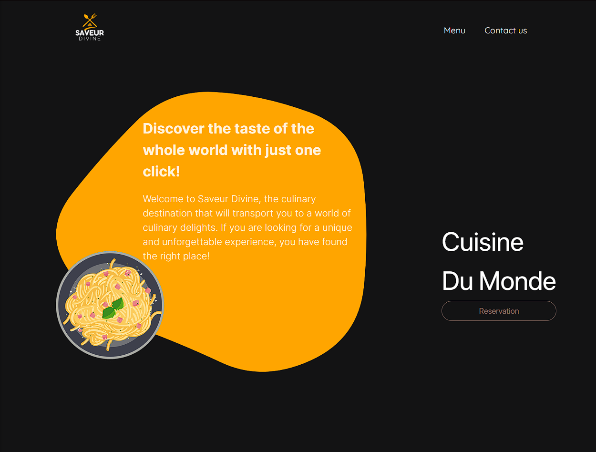
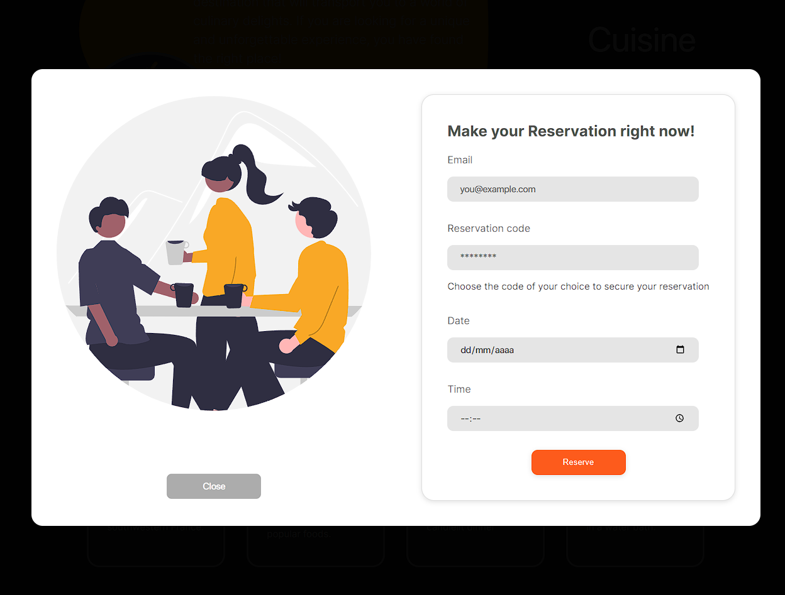
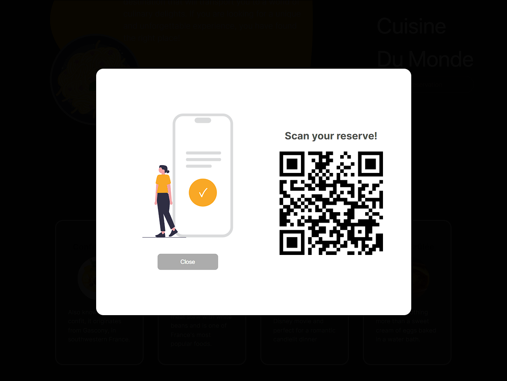
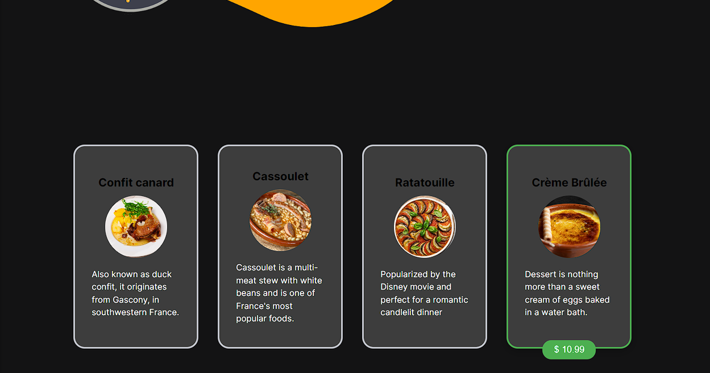

# 🍷 saveur-divine

Explorando um universo de pratos franceses deliciosos, na Saveur Divine, estamos empenhados em conectar você ao seu restaurante favorito com apenas um clique.

A essência deste projeto reside em aprimorar minhas habilidades no desenvolvimento natural com React Native. Assumi esse desafio com a determinação de enfrentar não apenas as complexidades da linguagem, mas também de proporcionar a mais excelente experiência ao usuário.

Seja bem-vindo ao Saveur Divine, onde a autenticidade culinária e a tecnologia se unem para sua satisfação.

## 🏠 Home

# 📅 Reserva

Nossa iniciativa oferece a você a capacidade de efetuar reservas em nosso restaurante de maneira ágil e eficiente. Após a confirmação, você receberá um e-mail de confirmação para garantir todos os detalhes.

Após a validação de todos os dados, nós disponibilizamos para você um QR Code, assim você poderá mandar para seus acompanhantes e assim, ficarem por dentro de sua reserva!

## 📲 QR Code

Se você estiver curioso e esta for a sua primeira reserva em nosso restaurante, apresentamos abaixo o nosso Menu, destacando alguns pratos que são a verdadeira essência da excelência que oferecemos.

## ⚠️ Atenção

Esta aplicação ainda está em desenvolvimento, por isso estará disponível abaixo uma lista das funcionalidades e atualizações restantes para a finalização do desenvolvimento.

- [ ] Implementar a lista e os métodos de seleção de mesas.
- [ ] Certificar de que todas as telas e componentes estejam responsivos.
- [ ] Página com as informações essenciais para que o cliente visualize sua reserva pelo QR Code.
- [ ] Incrementar a validação dos campos 'Date' e 'Time'. 
- [ ] Criar testes unitários.
- [ ] Footer interativo com animações e UX.
